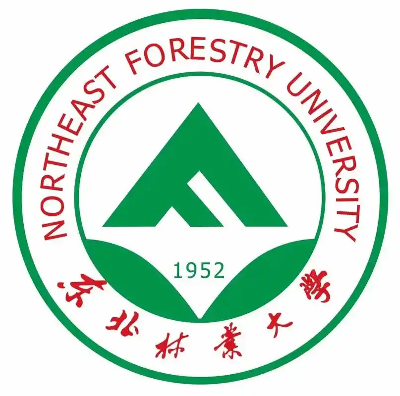

I am a M.Sc student majoring in Pattern Recognition at [School of HFIPS](https://english.hf.cas.cn/), [University of Science and Technology](http://en.ustc.edu.cn/). My research interest includes computer vision, computer graphics, machine learning, and computational photography.

I am very fortunate to be advised by [Prof. Kong](https://auto.ustc.edu.cn/2021/0510/c25976a484868/page.htm) of Biomimetic Perception and Control Laboratory from School of HFIPS, University of Science and Technology.

You can find my CV here: [Scrat's Curriculum Vitae](../assets/Curriculum_Vitae.pdf).

[Email](mailto:song_ustc@mail.ustc.edu.cn) / [Github](https://github.com/LiuSong-Scrat) / [CSDN](https://blog.csdn.net/qq_57994524?type=blog)

News
======
🎉2023.04	第二十二届RoboMaster2023机甲大师高校联盟赛(黑龙江站)	冠军

🎉2023.04	第二十二届RoboMaster2023机甲大师高校联盟赛(沈阳站)	亚军

🎉2023.08	第二十二届RoboMaster2023超级对抗赛（全球总决赛）	全国一等奖

2022.08	第十七届全国大学生智能汽车竞赛（完全模型组）	全国一等奖

2022.08	第二十一届RoboMaster2022超级对抗赛（全球总决赛）	全国二等奖

2022.12	第十七届全国大学生智能汽车竞赛 (室外远程驾驶无人车) 	全国二等奖

2021.12	第二十三届中国机器人及人工智能大赛（全地形小车）	全国三等奖

2022.08	第十五届全国大学生节能减排社会实践与科技竞赛	全国三等奖

2022.07	第十七届全国大学生智能汽车竞赛东北赛区（线下）	第一名

2022.11	2022高教社杯全国大学生数学建模竞赛	省级二等奖

2022.08	第三十八届美国国际大学生数学建模竞赛	H奖

2023.05	国家级大学生创新创业训练项目《异形包裹自动分拣系统》	优秀项目

Many of the features of dynamic content management systems (like Wordpress) can be achieved in this fashion, using a fraction of the computational resources and with far less vulnerability to hacking and DDoSing. You can also modify the theme to your heart's content without touching the content of your site. If you get to a point where you've broken something in Jekyll/HTML/CSS beyond repair, your markdown files describing your talks, publications, etc. are safe. You can rollback the changes or even delete the repository and start over - just be sure to save the markdown files! Finally, you can also write scripts that process the structured data on the site, such as [this one](https://github.com/academicpages/academicpages.github.io/blob/master/talkmap.ipynb) that analyzes metadata in pages about talks to display [a map of every location you've given a talk](https://academicpages.github.io/talkmap.html).

Research
======
Development of All-directional Automatic Scanning Sorting System for Irregular Packages

Tomato-GraspNet：An end-to-end tomato grasp detection network for agriculture based on RGB-XYZ fusion with MHCA

Site-wide configuration
------
For site content, there is one markdown file for each type of content, which are stored in directories like _publications, _talks, _posts, _teaching, or _pages. For example, each talk is a markdown file in the [_talks directory](https://github.com/academicpages/academicpages.github.io/tree/master/_talks). At the top of each markdown file is structured data in YAML about the talk, which the theme will parse to do lots of cool stuff. The same structured data about a talk is used to generate the list of talks on the [Talks page](https://academicpages.github.io/talks), each [individual page](https://academicpages.github.io/talks/2012-03-01-talk-1) for specific talks, the talks section for the [CV page](https://academicpages.github.io/cv), and the [map of places you've given a talk](https://academicpages.github.io/talkmap.html) (if you run this [python file](https://github.com/academicpages/academicpages.github.io/blob/master/talkmap.py) or [Jupyter notebook](https://github.com/academicpages/academicpages.github.io/blob/master/talkmap.ipynb), which creates the HTML for the map based on the contents of the _talks directory).

Experience
======

    <h1>Experience</h1>
    

        <!-- badge -->
            

        <!-- content -->
            

                <h3><a href="http://en.ustc.edu.cn/" class="institute-title">University of Science and Technology</a></h3>
                
2022.09 - Present&nbsp;&nbsp;•&nbsp;&nbsp;Postgraduate student

                
Research Advisor: Prof. <a href="https://yanweifu.github.io">Yanwei Fu</a> &amp; Prof. <a href="https://istbi.fudan.edu.cn/lnen/info/1157/1632.htm">Shouyan Wang</a>

            

    

    

        <!-- badge -->
            

        <!-- content -->
            

                <h3><a href="https://en.nefu.edu.cn/" class="institute-title">Northeast Forest University  of  (NUIST)</a></h3>
                
2018.09 - 2022.06&nbsp;&nbsp;•&nbsp;&nbsp;Undergraduate student

                
GPA ranking: 2/163

                
Research Advisor: Prof. <a href="https://sites.google.com/view/xiaolongxu">Xiaolong Xu</a>

            

    

    

          <!-- badge -->
              
      
          <!-- content -->
              

                  <h3><a href="https://www.shlab.org.cn/" class="institute-title">Shanghai AI Laboratory</a></h3>
                  
2025.02 - Present&nbsp;&nbsp;•&nbsp;&nbsp;Research Intern

                  
Mentor: Dr. <a href="https://yding25.com/">Yan Ding</a>

              

    

<!-- 

<h2>University of Science and Technology(USTC)</h2>
<h3 style="color:rgba(222, 222, 210, 0.9)">
2024.09-2027.06</h3>

<h2>Northeast Forest University(NEFU)</h2>
<h4 style="color:rgba(222, 222, 210, 0.9)">
2020.09-2024.06</h3>

<h2>IFLYTEK</h2>
<h3 style="color:rgba(222, 222, 210, 0.9)">
2024.09-2024.12</h3>

<h2>GALAXEA</h2>
<h3 style="color:rgba(222, 222, 210, 0.9)">
2020.4-2024.07</h3>

 -->

Selected Awards and Honors
======